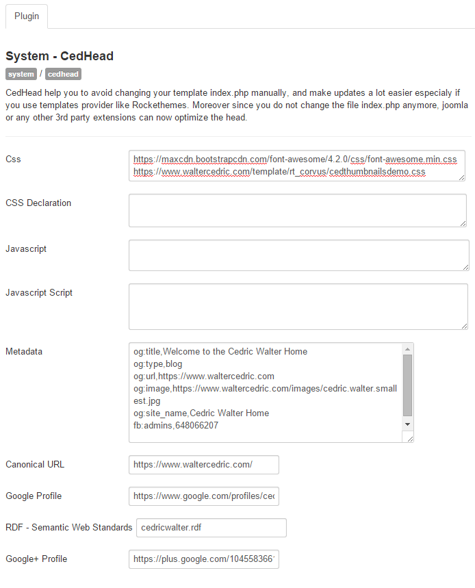

# CedHead for Joomla

CedHead for [Joomla!](https://www.joomla.org) help you to avoid changing your template index.php manually, and make updates a lot easier especially if you use templates provider like Rockethemes. Moreover since you do not change the file index.php anymore, Joomla! or any other 3rd party extensions (RokBooster) can now optimize the head.

* Free

## Documentation
[https://www.galaxiis.com/cedhead-doc/](https://www.galaxiis.com/cedhead-doc/)